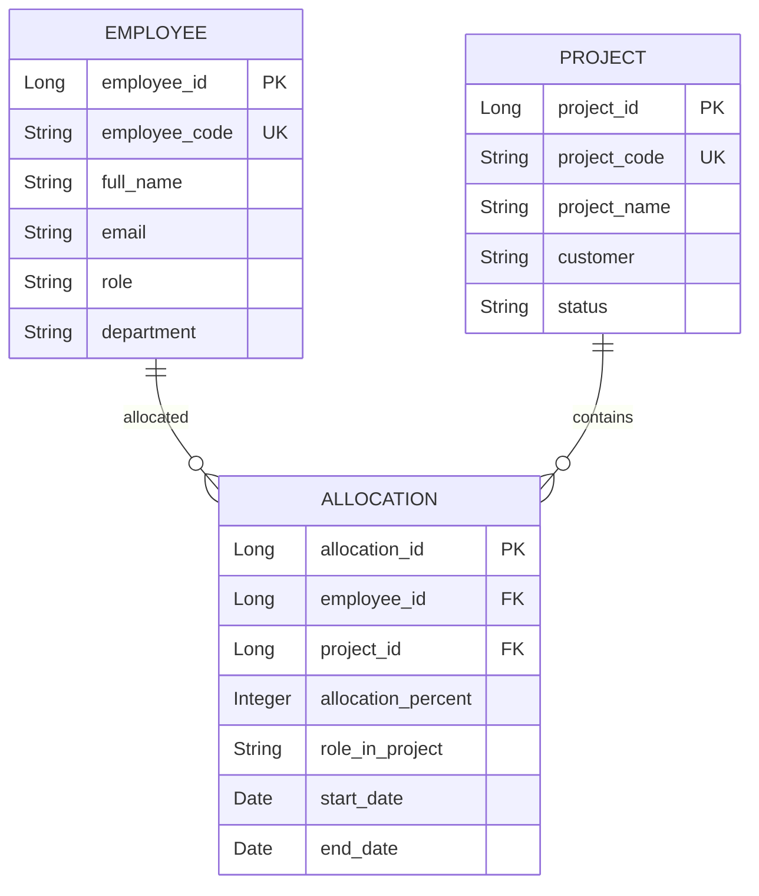

# Project Resource Allocation Management System

Hệ thống quản lý phân bổ nguồn nhân lực cho các dự án phần mềm trong các công ty outsourcing. Hệ thống cho phép các Quản lý dự án (PM) và Quản lý nhân sự (Resource Manager) theo dõi workload của nhân sự, tìm kiếm nhân sự khả dụng, quản lý dự án và phân bổ thời gian hợp lý.

---

## 🛠️ Công Nghệ Sử Dụng (Tech Stack)

- **Ngôn ngữ**: Java 25
- **Framework**: Spring Boot 4.1.0
- **Lưu trữ dữ liệu**: PostgreSQL
- **ORM & Database Access**: Spring Data JPA & Hibernate
- **Tiện ích**: Lombok, MapStruct (dùng để map DTO/Entity), Jakarta Validation (`@NotBlank`, `@Email`, `@Min`, `@Max`,...)
- **Quản lý dự án & Build**: Maven
- **CI/CD**: GitHub Actions (Tự động chạy test cùng PostgreSQL container trên nhánh `main`)

---

## 💾 Thiết Kế Cơ Sở Dữ Liệu (Database Schema)

Hệ thống bao gồm 3 bảng chính: `employee`, `project`, và `allocation`.



---

## 🎯 Quy Tắc Nghiệp Vụ (Business Rules)

1. **Phần trăm phân bổ**: Tỉ lệ phân bổ của một nhân viên vào một dự án cụ thể phải nằm trong khoảng: `0 < allocation <= 100`.
2. **Tổng tỉ lệ phân bổ tối đa**: Tổng tỉ lệ phân bổ của một nhân viên trên tất cả các dự án đang hoạt động không được vượt quá `100%`. Nếu vượt quá, hệ thống sẽ trả về lỗi `400 Bad Request` với message: `"Employee allocation exceeds 100%"`.
3. **Trạng thái dự án**: Không cho phép phân bổ (allocate) nhân sự vào dự án đã ở trạng thái **HOÀN THÀNH** (`COMPLETED`).

---

## 🗺️ Danh Sách API (API Endpoints)

### 👥 Quản lý Nhân Viên (Employee Management)

| HTTP Method | Endpoint | Mô Tả |
| :--- | :--- | :--- |
| `POST` | `/employees` | Tạo mới nhân viên |
| `GET` | `/employees` | Lấy danh sách toàn bộ nhân viên |
| `GET` | `/employees/{code}` | Lấy chi tiết nhân viên theo mã |
| `PUT` | `/employees/{code}` | Cập nhật thông tin nhân viên theo mã |

### 📁 Quản lý Dự Án (Project Management)

| HTTP Method | Endpoint | Mô Tả |
| :--- | :--- | :--- |
| `POST` | `/projects` | Tạo mới dự án |
| `GET` | `/projects` | Lấy danh sách toàn bộ dự án |
| `GET` | `/projects/{code}` | Lấy chi tiết dự án theo mã |
| `PUT` | `/projects/{code}` | Cập nhật thông tin dự án theo mã |

### 📊 Phân Bổ Nhân Sự (Resource Allocation)

| HTTP Method | Endpoint | Mô Tả |
| :--- | :--- | :--- |
| `POST` | `/allocations` | Tạo mới phân bổ nhân sự vào dự án |
| `GET` | `/allocations` | Lấy danh sách toàn bộ phân bổ |
| `PUT` | `/allocations/{id}` | Cập nhật thông tin phân bổ theo ID |

### 📈 Báo Cáo Workload & Utilization (Reporting)

| HTTP Method | Endpoint | Mô Tả |
| :--- | :--- | :--- |
| `GET` | `/employees/{code}/workload` | Xem chi tiết workload hiện tại của 1 nhân viên |
| `GET` | `/reports/utilization` | Báo cáo tỉ lệ utilization (tổng phân bổ) của từng nhân viên |
| `GET` | `/reports/available` | Báo cáo danh sách nhân sự còn thời gian khả dụng (tổng phân bổ < 100%) |
| `GET` | `/reports/overloaded` | Báo cáo danh sách nhân sự có workload cao (tổng phân bổ > 90%) |

---

## 🚀 Hướng Dẫn Cài Đặt & Khởi Chạy

### 1. Yêu Cầu Hệ Thống

- **Java JDK 25**
- **Maven 3.8+**
- **PostgreSQL 15+**

### 2. Cấu Hình Cơ Sở Dữ Liệu

1. Khởi chạy cơ sở dữ liệu PostgreSQL cục bộ.
2. Tạo một database mới có tên là: `resource-management-db`.
3. Kiểm tra hoặc cập nhật thông tin kết nối DB (URL, Username, Password) trong file cấu hình tại [application.yaml](src/main/resources/application.yaml):
   ```yaml
   spring:
     datasource:
       url: jdbc:postgresql://localhost:5432/resource-management-db?serverTimezone=Asia/Ho_Chi_Minh
       username: postgres
       password: your_postgres_password
   ```

### 3. Chạy Ứng Dụng Cục Bộ

Sử dụng Maven Wrapper để chạy dự án Spring Boot:
```bash
./mvnw spring-boot:run
```
Ứng dụng sẽ mặc định khởi chạy tại cổng `8080`.

### 4. Chạy Kiểm Thử (Run Tests)

Để thực thi toàn bộ unit và integration tests của dự án:
```bash
./mvnw test
```

---

## 🔄 Luồng Tích Hợp Liên Tục (CI/CD)

Hệ thống được tích hợp quy trình kiểm thử tự động bằng **GitHub Actions** thông qua cấu hình trong [.github/workflows/maven.yml](.github/workflows/maven.yml). Mỗi khi có commit mới được push lên hoặc tạo pull request vào nhánh `main`, luồng CI sẽ tự động thực hiện:

1. Khởi tạo một Docker container chạy cơ sở dữ liệu **PostgreSQL** (`resource-management-db`) trên môi trường CI.
2. Thiết lập môi trường chạy với **JDK 25**.
3. Chạy toàn bộ các ca kiểm thử tích hợp (integration tests) thông qua câu lệnh:
   ```bash
   mvn clean test -Dspring.jpa.hibernate.ddl-auto=update
   ```
4. Đảm bảo mã nguồn luôn ổn định và không xảy ra xung đột nghiệp vụ trước khi tiến hành tích hợp hay triển khai.
